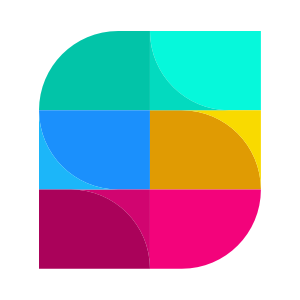

# Strety Commons

A community board where the Strety team shares posts and bookmarks the ones they want to get back to.

## Getting Started

### Prerequisites

- Ruby 3.4.7
- Node 25.6.0
- Yarn
- SQLite3

If you don't have these versions installed, we recommend using [mise](https://mise.jdx.dev/getting-started.html) to manage tool versions. Once mise is installed:

```bash
mise install
```

This will pick up the Ruby and Node versions from the `.ruby-version` and `.node-version` files in the repo.

### Setup

Clone the repo and run the setup script:

```bash
git clone <repo-url>
cd product-design-exercise
bin/setup
```

This will install Ruby and JavaScript dependencies, set up the database, seed it with sample data, and start the development server.

If you've already set up and just want to start the server:

```bash
bin/dev
```

The app will be available at http://localhost:3000.

## The Exercise

Open [PITCH.md](PITCH.md) for the full brief. It describes the feature you'll be building: the bookmarks listing for Strety Commons.

The short version: bookmarking a post already works (you can toggle the bookmark icon on any post). Your job is to build the other side of that, giving users a way to see and manage their bookmarks.

Take a look around the app first. Create some posts, bookmark a few, and get a feel for how things work before diving in.
